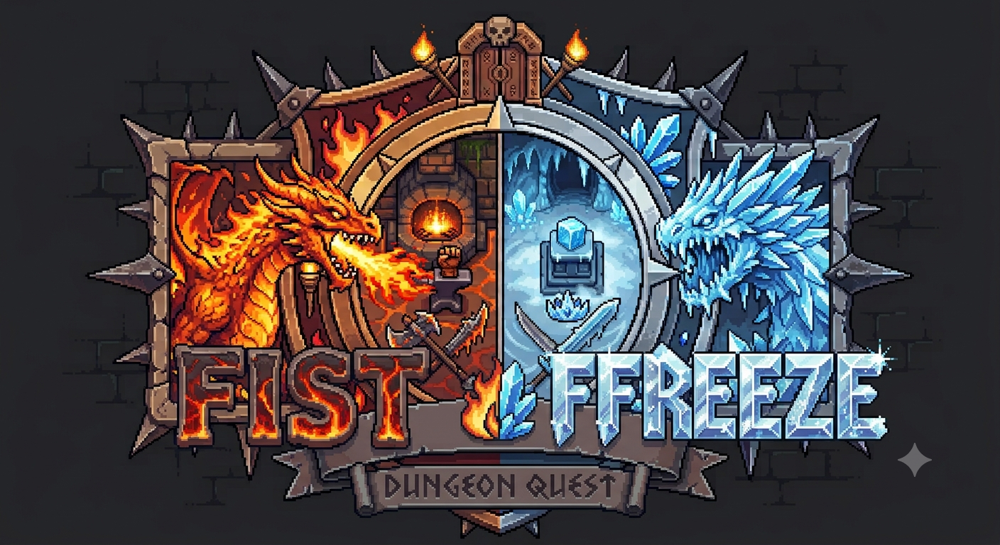
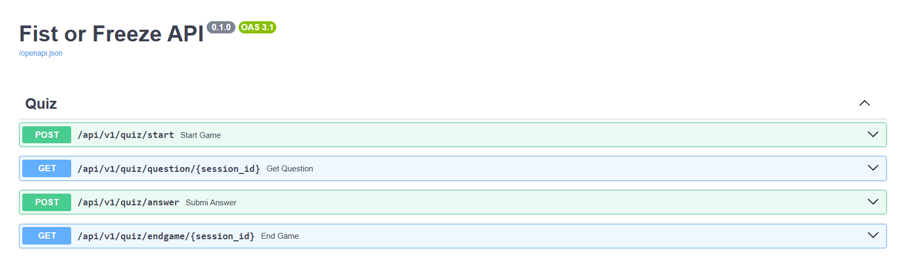
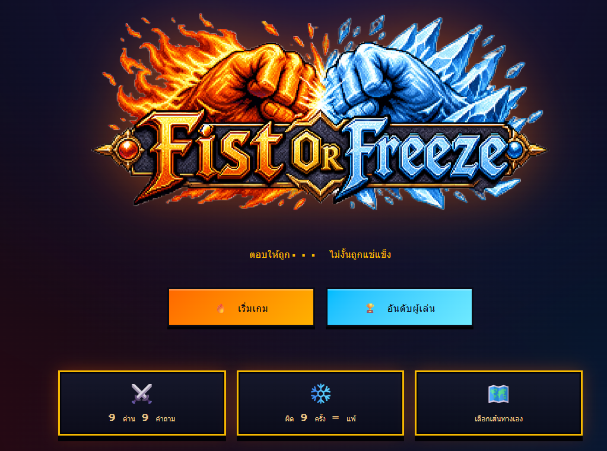

Repository นี้สร้างขึ้นมาเพื่อเรียนรู้การสร้าง และจำลองการทำงานของ LLM models ผ่าน FastAPI, Ollama และ project structure

## 🛠️ Tech Stack

- **Backend:** FastAPI
- **LLM:** llama3.2, gemma3:4b, qwen3.5:9b, gemini-3.5-flash-lite (ใช้จริงตัวนี้)
- **Tools & DevOps:** Docker, GitHub Actions, Pip-tools, Swagger, Render

## 🚀 Getting Started

1. เปิด API service ให้ทำงานก่อน เพราะ Render free plan ไม่ได้เปิด service ให้ตลอดเวลา
    * เข้าไปที่ [Backend service](https://fist-or-freeze.onrender.com/docs)
    * รอให้ขึ้นหน้าตามรูปด้านล่างแล้วไปข้อ 2

2. เปิดหน้า [Fist or Freeze](https://fist-or-freeze-quest.lovable.app) แล้วกดเริ่มเกม กรอกข้อมูล เพื่อทดลองเล่นได้เลย

3. อย่ากดเล่นเยอะเกินเดี๋ยว Token หมดจ้าใช้ของฟรี

## ✨ API Method
Deploy API บน Render free plan (ไม่ได้เปิด service ตลอดเวลา) จำเป็นต้องเข้าไปเพื่อเปิด Service ก่อนใช้งานผ่าน Frontend
- [อ่าน Documents](https://fist-or-freeze.onrender.com/docs)

